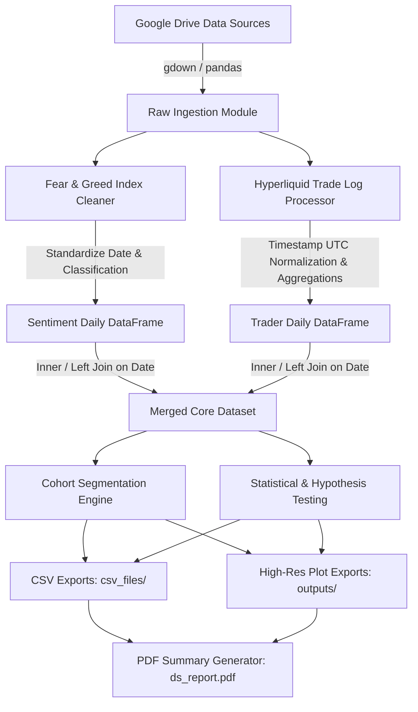

# Technical Requirements Document (TRD)
## Web3 Trading Analytics: Data Pipeline, Statistical Engine & Pipeline Architecture

---

## 1. System Overview & Tech Stack

### 1.1 Technical Purpose
The Technical Requirements Document (TRD) outlines the data engineering, schema definitions, mathematical formulations, feature engineering pipelines, statistical methodologies, and execution standards required to implement the Web3 Trader Behavior vs. Market Sentiment analysis.

### 1.2 Tech Stack & Runtime Environment
* **Language & Runtime:** Python 3.10+ (Executed via Google Colab & local Jupyter kernels).
* **Data Manipulation & Computation:** `pandas >= 2.0.0`, `numpy >= 1.24.0`.
* **Statistical Engine:** `scipy.stats`, `statsmodels`.
* **Visualization Engine:** `matplotlib >= 3.7.0`, `seaborn >= 0.12.0`, `plotly >= 5.14.0`.
* **PDF & Artifact Generation:** `reportlab` or `fpdf2` for automated `ds_report.pdf` compilation.
* **Storage & Versioning:** Standard CSV output files in `csv_files/`, PNG/JPG figures in `outputs/`.

---

## 2. Data Engineering & Pipeline Architecture



### 2.1 Schema Definitions & Ingestion Rules

#### 2.1.1 Fear & Greed Sentiment Dataset
```python
sentiment_schema = {
    'Date': 'datetime64[ns]',          # Standardized to YYYY-MM-DD
    'Classification': 'category',      # Ordinal: ['Extreme Fear', 'Fear', 'Neutral', 'Greed', 'Extreme Greed']
    'Value': 'Int64'                   # Numerical index score (0 to 100)
}
```
* **Validation Check:** Ensure unique `Date` values; drop duplicate entries.

#### 2.1.2 Hyperliquid Historical Trader Dataset
```python
trader_schema = {
    'account': 'string',               # Ethereum / Hyperliquid wallet address format
    'symbol': 'category',             # Contract ticker (e.g. ETH, BTC, SOL)
    'execution price': 'float64',      # Trade fill price in USD
    'size': 'float64',                 # Position size / quantity
    'side': 'category',               # Direction: ['Buy', 'Sell', 'Long', 'Short']
    'time': 'datetime64[ns, UTC]',     # Execution timestamp
    'start position': 'float64',      # Pre-execution position size
    'event': 'category',              # Order type / trigger event
    'closedPnL': 'float64',           # Realized profit/loss in USD
    'leverage': 'float64'              # Position leverage multiplier
}
```

### 2.2 Time Alignment & Join Logic
Hyperliquid trade executions contain granular millisecond timestamps, whereas the Fear & Greed index is published daily.
1. Extract `Date = time.dt.date` from trade logs (ensuring explicit UTC alignment).
2. Group granular trade events by `Date` and `account` to calculate daily aggregate trader metrics.
3. Perform a relational `LEFT JOIN` on `Date`:
   $$\text{Merged Dataset} = \text{AggregatedTraderMetrics} \bowtie_{\text{Date}} \text{SentimentIndex}$$

---

## 3. Mathematical Formulations & Feature Engineering

### 3.1 Derived Trader Performance Metrics
For a given trader $i$ on date $t$ with $N$ execution logs:

1. **Net Daily Realized PnL ($PnL_{i,t}$):**
   $$PnL_{i,t} = \sum_{k=1}^{N} \text{closedPnL}_{k}$$

2. **Total Traded Volume ($Vol_{i,t}$):**
   $$Vol_{i,t} = \sum_{k=1}^{N} (\text{execution price}_k \times \text{size}_k)$$

3. **Win Rate ($WR_{i,t}$):**
   $$WR_{i,t} = \frac{\sum_{k=1}^{N} \mathbb{I}(\text{closedPnL}_k > 0)}{\sum_{k=1}^{N} \mathbb{I}(\text{closedPnL}_k \neq 0)} \times 100$$

4. **Profit Factor ($PF_i$):**
   $$PF_i = \frac{\sum \max(0, \text{closedPnL})}{\left| \sum \min(0, \text{closedPnL}) \right|}$$

5. **Long / Short Directional Ratio ($LSR_{i,t}$):**
   $$LSR_{i,t} = \frac{\text{Count}(\text{side} \in \{\text{Buy}, \text{Long}\})}{\text{Count}(\text{side} \in \{\text{Sell}, \text{Short}\}) + \epsilon}$$

6. **Weighted Average Leverage ($\bar{L}_{i,t}$):**
   $$\bar{L}_{i,t} = \frac{\sum_{k=1}^{N} (\text{leverage}_k \times \text{size}_k)}{\sum_{k=1}^{N} \text{size}_k}$$

### 3.2 Trader Cohort Segmentation
Traders are categorized into deciles based on cumulative realized profit:
* **Top Decile (Top 10% Performers):** Cumulative PnL $\ge P_{90}(\text{Cumulative PnL})$.
* **Bottom Decile (Bottom 10% Underperformers):** Cumulative PnL $\le P_{10}(\text{Cumulative PnL})$.

---

## 4. Statistical Testing Engine

To validate project hypotheses, the following statistical tests will be executed programmatically in `notebook_1.ipynb`:

| Hypothesis | Statistical Test | Variable A | Variable B | Target Significance ($\alpha$) |
| :--- | :--- | :--- | :--- | :--- |
| **H1 (Leverage Escalation)** | Mann-Whitney U Test | Leverage in `Extreme Greed` | Leverage in `Extreme Fear` | $p < 0.05$ |
| **H2 (Contrarian Bias)** | Chi-Square ($\chi^2$) Goodness of Fit | Long/Short Ratio by Cohort | Sentiment Regime Category | $p < 0.05$ |
| **H3 (Win Rate Degradation)** | Kruskal-Wallis H Test | Win Rate across 5 Sentiment Regimes | Sentiment Classification | $p < 0.05$ |
| **H4 (Correlation)** | Spearman Rank Correlation | Numerical Sentiment Value | Aggregate Liquidation Volume | $r_s$, $p < 0.05$ |

---

## 5. Output Specifications & File Pipeline

### 5.1 Processed Data Exports (`csv_files/`)
* `merged_trader_sentiment.csv`: Full record-level joined dataset with calculated daily features.
* `daily_sentiment_metrics.csv`: Aggregated market-wide metrics grouped by sentiment classification.
* `trader_cohort_summary.csv`: Summary metrics for Top 10%, Middle 80%, and Bottom 10% trader cohorts.

### 5.2 Plot Generation Standards (`outputs/`)
All generated plots must follow these graphic guidelines:
* **Resolution:** Minimum 300 DPI (`plt.savefig(..., dpi=300, bbox_inches='tight')`).
* **Format:** PNG / JPG.
* **Palette:** Web3 dark theme or clean high-contrast color scheme (e.g., `#1E1E2E` background, `#00E676` green for profit/longs, `#FF5252` red for loss/shorts).

#### Required Figures:
1. `pnl_vs_sentiment.png`: Boxplot / Violin plot showing trader daily PnL distribution across 5 sentiment categories.
2. `leverage_distribution_by_regime.png`: Density plot / KDE of leverage used in Fear vs Greed.
3. `long_short_ratio_heatmap.png`: Heatmap of Long/Short position ratios segmented by trader performance cohort and market regime.
4. `winrate_by_cohort.png`: Bar chart comparing Win Rate (%) of Top vs Bottom decile traders across market sentiment.

### 5.3 PDF Report Generation (`ds_report.pdf`)
* Standard submission format requires `ds_report.pdf` containing executive summary, methodology, embedded visualizations from `outputs/`, statistical test results, and final trading strategy recommendations.

---

## 6. Edge Cases & Exception Handling

1. **Zero / Null Trade Days:** Fill zero trade volume days with 0; avoid dropping sentiment rows.
2. **Infinite Profit Factor:** Replace zero-loss denominators with $\epsilon = 1e^{-6}$.
3. **Outliers & Extreme Leverage:** Apply 1st and 99th percentile winsorization / trimming when visualizing PnL and leverage to prevent scale distortion.
4. **Timezone Mismatch:** Convert exchange timestamps explicitly to UTC before extracting date components (`pd.to_datetime(unit='ms', utc=True)`).
