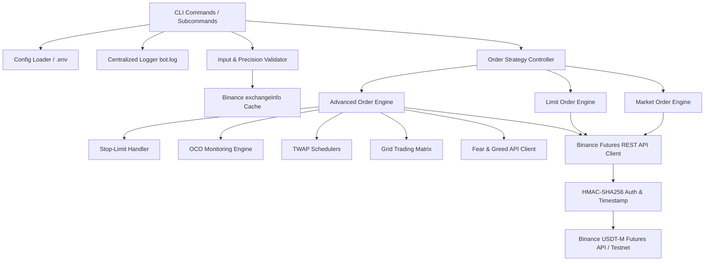

# Technical Requirement Document (TRD): Binance Futures Order Bot

## 1. System Architecture & High-Level Design

### 1.1 Overview
The Binance Futures Order Bot is a modular Python CLI application built to interact with Binance USDT-M Futures APIs. It enforces strict input validation, precise order rounding according to exchange rules, structured audit logging, and automated execution strategies (TWAP, Grid, OCO).

### 1.2 Component Architecture Diagram


---

## 2. Technology Stack & Technical Specifications

| Layer | Technology / Library | Version / Detail |
| :--- | :--- | :--- |
| **Language** | Python | `>= 3.10` |
| **HTTP Client / SDK** | `requests` or `python-binance` | Standard HTTP REST wrapper with HMAC SHA256 auth |
| **Data Validation** | `pydantic` or custom `dataclasses` | Datatype, symbol format, and numerical boundary checking |
| **Environment Config** | `python-dotenv` | Loads `.env` file variables securely |
| **Logging** | Python `logging` standard library | Multi-handler (File & Console) with custom sensitive key filter |
| **Testing** | `pytest`, `unittest.mock` | Unit test suite & mocked Binance REST response tests |

---

## 3. Data Flow & Interface Specifications

### 3.1 Binance USDT-M Futures API Specifications
- **Base URLs**:
  - Production: `https://fapi.binance.com`
  - Testnet: `https://testnet.binancefuture.com`
- **Authentication**: HMAC-SHA256 signed headers (`X-MBX-APIKEY`) with timestamp parameter `recvWindow=5000`.

#### Key REST Endpoints
1. `GET /fapi/v1/exchangeInfo`: Fetches symbol rules (`tickSize`, `stepSize`, `minQty`, `notional`). Cached locally on bot initialization.
2. `POST /fapi/v1/order`: Core order placement endpoint.
   - Core parameters: `symbol`, `side`, `type` (`MARKET`, `LIMIT`, `STOP`), `quantity`, `price`, `timeInForce` (`GTC`), `stopPrice`.
3. `DELETE /fapi/v1/order`: Cancels an active open order.
4. `GET /fapi/v1/openOrders`: Queries pending orders for OCO management.
5. `GET /fapi/v2/account`: Queries account balance & available margin.

### 3.2 External API Integration (Bonus)
- **Fear & Greed Index API**: `https://api.alternative.me/fng/?limit=1`
- **Response Handling**: Extracts integer `value` (0-100) and `value_classification` ("Extreme Fear", "Fear", "Neutral", "Greed", "Extreme Greed") to adjust grid position risk limits dynamically.

---

## 4. Module Specifications & Internal Logic

### 4.1 `src/config.py` (Configuration Manager)
- Loads `BINANCE_API_KEY`, `BINANCE_API_SECRET`, and `USE_TESTNET` boolean flags.
- Validates presence of credentials before executing any order.

### 4.2 `src/client.py` (Binance REST Client Facade)
- Encapsulates signature creation (`hmac.new(secret, payload, hashlib.sha256)`).
- Enforces Rate Limit handling (Weight: 1200/min). Implements automatic retry with exponential backoff on HTTP status `429` / `5xx`.
- Redacts sensitive API keys and secrets before passing payloads to the logger.

### 4.3 `src/validator.py` (Precision & Input Validator)
- **Symbol Check**: Ensures regex pattern `^[A-Z0-9-]{5,12}$` matches active contract lists.
- **Precision Adjuster**:
  - `price_precision`: Quantizes price to `tickSize` (e.g., `0.10`).
  - `quantity_precision`: Quantizes quantity to `stepSize` (e.g., `0.001`).
- **Formula**:
  $$ \text{Quantized Value} = \text{Round}\left(\left\lfloor \frac{\text{Value}}{\text{Step Size}} \right\rfloor \times \text{Step Size}, \text{Decimals}\right) $$

### 4.4 `src/logger.py` (Logging Subsystem)
- Outputs to `bot.log` and standard output stream.
- Structured Log Format: `%(asctime)s | %(levelname)s | %(name)s | %(message)s`
- Includes a custom `LoggingFilter` that strips out `X-MBX-APIKEY` and signature string parameters.

### 4.5 `src/market_orders.py` & `src/limit_orders.py`
- Executable script entrypoints handling CLI argument parsing using `argparse`.
- Validates input -> Formats precision -> Calls `client.place_order()` -> Outputs formatted result to console & `bot.log`.

### 4.6 Advanced Order Engines (`src/advanced/`)
- `stop_limit.py`: Submits a `STOP` or `STOP_MARKET` order with `stopPrice` and `price`.
- `oco.py`: Spawns two child orders: Take-Profit Limit and Stop-Loss Market. Listens to order status; when one transitions to `FILLED`, issues a `DELETE` request for the partner order ID.
- `twap.py`: Calculates chunk quantity = $\frac{\text{Total Qty}}{\text{Num Chunks}}$ and interval = $\frac{\text{Duration Seconds}}{\text{Num Chunks}}$. Executes Market/Limit chunks asynchronously using `asyncio.sleep()` or polling loops.
- `grid_strategy.py`: Calculates $N$ price intervals between $P_{\text{lower}}$ and $P_{\text{upper}}$. Places multi-level Buy Limit and Sell Limit orders across the grid matrix.

---

## 5. Error Taxonomy & Exception Handling

```text
BotBaseException
├── ConfigurationError      (Missing or invalid .env API credentials)
├── ValidationError          (Invalid symbol, negative qty, precision mismatch)
├── BinanceAPIException      (Base class for remote Binance errors)
│   ├── InsufficientMarginError (Binance API code -2019)
│   ├── OrderRejectedException  (Binance API code -2010)
│   └── RateLimitExceededError  (HTTP 429)
└── StrategyExecutionError   (TWAP / Grid calculation or timeout failures)
```

---

## 6. Implementation Code Structure

```text
[project_root]/
├── src/
│   ├── __init__.py
│   ├── config.py
│   ├── client.py
│   ├── validator.py
│   ├── logger.py
│   ├── market_orders.py
│   ├── limit_orders.py
│   └── advanced/
│       ├── __init__.py
│       ├── stop_limit.py
│       ├── oco.py
│       ├── twap.py
│       ├── grid_strategy.py
│       └── fear_greed.py
├── tests/
│   ├── test_validator.py
│   ├── test_client.py
│   └── test_advanced_orders.py
├── .env.example
├── bot.log
├── report.pdf
├── README.md
└── requirements.txt
```

---

## 7. Verification & Test Suite Blueprint

1. **Unit Verification (`pytest tests/`)**:
   - `test_validator_precision`: Test float rounding against Binance `tickSize` and `stepSize`.
   - `test_signature_generation`: Verify HMAC-SHA256 signature algorithm against known test vectors.
2. **Integration Verification (Binance Testnet)**:
   - Execute test Market Order: `python src/market_orders.py BTCUSDT BUY 0.01`
   - Verify non-zero response ID and verify `bot.log` entry.
   - Execute Limit Order: `python src/limit_orders.py BTCUSDT BUY 0.01 50000`
   - Cancel Limit Order and verify status update in log.
